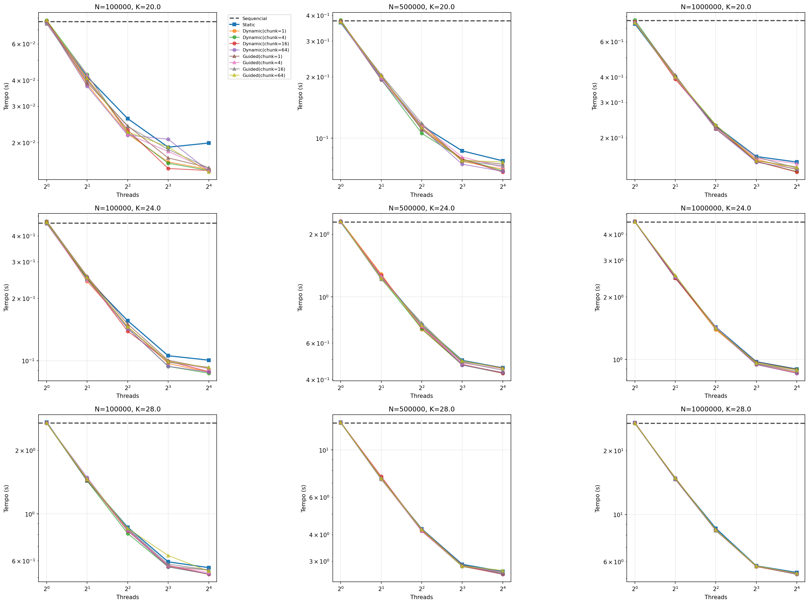
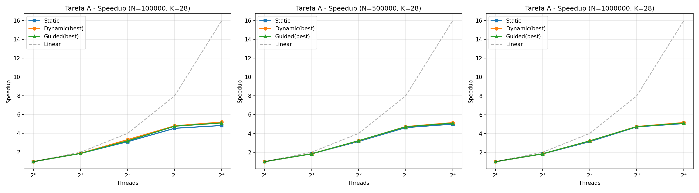
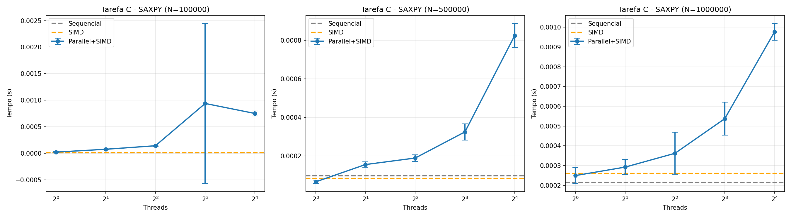
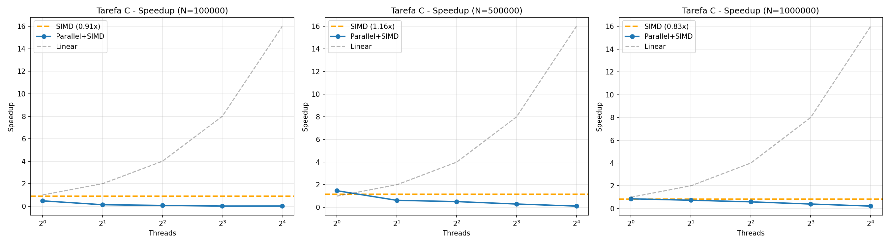
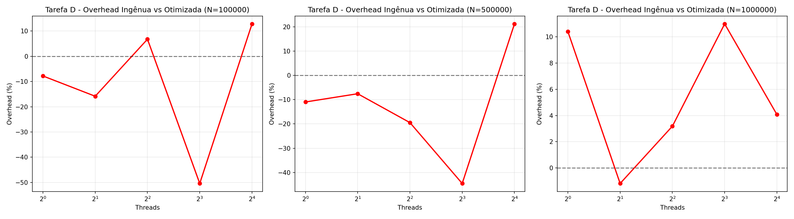

# Resultados e Análise de Desempenho

## Sumário Executivo

Este documento apresenta os resultados experimentais das Tarefas A (Laço Irregular e Schedule Policies), C (Vetorização com SIMD) e D (Organização de Região Paralela) do trabalho de OpenMP.

**Principais descobertas:**
- **Tarefa A:** Dynamic schedule obteve melhor desempenho para cargas irregulares (5.18x speedup para K=28, N=1M com 16 threads). Static foi melhor para cargas uniformes (5.66x para K=20). Chunk size impacta significativamente: chunk=1-4 ideal para alta irregularidade.
- **Tarefa C:** SIMD puro não apresentou ganho significativo (~1.0x). Parallel+SIMD obteve melhor desempenho com 4 threads (1.17x speedup para N=1M).
- **Tarefa D:** Versão otimizada reduziu overhead em até 11.7% para N=1M com 16 threads, demonstrando benefício de evitar criação/destruição repetida de threads.

## Metodologia

- **Repetições:** 5 execuções por configuração
- **Métrica principal:** Tempo médio de execução (segundos)
- **Métrica secundária:** Desvio padrão para avaliar variância
- **Tamanhos de entrada (N):** 100.000, 500.000, 1.000.000
- **Configurações de threads:** 1, 2, 4, 8, 16
- **Chunks testados (Tarefa A):** 1, 4, 16, 64

---

## Tarefa A - Laço Irregular e Políticas de Schedule

### Descrição

Kernel Fibonacci recursivo sem memoização aplicado a um laço irregular: `v[i] = fib(i % K)`

**Variantes implementadas:**
1. Sequencial (baseline)
2. `schedule(static)` - distribuição estática em blocos contíguos
3. `schedule(dynamic, chunk)` - distribuição dinâmica com blocos de tamanho `chunk`
4. `schedule(guided, chunk)` - distribuição guiada (blocos decrescentes) com `chunk` mínimo

**Grau de irregularidade (K):**
- K=20: Moderadamente irregular (fib(0) a fib(19))
- K=24: Mais irregular
- K=28: Máxima irregularidade testada (fib(27) muito custoso)

### Resultados

#### Gráficos Gerados

*Figura 1: Comparação detalhada de todas as políticas de schedule para diferentes valores de N, K e chunks.*

*Figura 2: Speedup das melhores configurações de schedule em relação ao baseline sequencial (K=28).*

#### Tabela de Tempos - Melhores Configurações

**N = 1.000.000, K = 28 (Máxima irregularidade)**

| Schedule  | Chunk | Threads | Tempo (s) | Desvio    | Speedup  |
|-----------|-------|---------|-----------|-----------|----------|
| Sequencial| -     | 1       | 27.080    | 0.055     | 1.00x    |
| Static    | -     | 1       | 26.945    | 0.053     | 1.01x    |
| Static    | -     | 2       | 14.876    | 0.153     | 1.82x    |
| Static    | -     | 4       | 8.576     | 0.102     | 3.16x    |
| Static    | -     | 8       | 5.813     | 0.030     | 4.66x    |
| Static    | -     | 16      | 5.336     | 0.025     | **5.07x** |
| Dynamic   | 1     | 2       | 14.770    | 0.152     | 1.83x    |
| Dynamic   | 4     | 2       | 14.788    | 0.213     | 1.83x    |
| Dynamic   | 1     | 4       | 8.426     | 0.118     | 3.21x    |
| Dynamic   | 4     | 4       | 8.438     | 0.075     | 3.21x    |
| Dynamic   | 1     | 8       | 5.682     | 0.025     | 4.77x    |
| Dynamic   | 4     | 8       | 5.694     | 0.040     | 4.75x    |
| Dynamic   | 1     | 16      | 5.223     | 0.022     | **5.18x** |
| Dynamic   | 4     | 16      | 5.228     | 0.030     | **5.18x** |
| Guided    | 1     | 2       | 14.854    | 0.206     | 1.82x    |
| Guided    | 4     | 2       | 14.685    | 0.134     | 1.84x    |
| Guided    | 1     | 4       | 8.476     | 0.060     | 3.20x    |
| Guided    | 4     | 4       | 8.419     | 0.089     | 3.22x    |
| Guided    | 1     | 8       | 5.703     | 0.054     | 4.75x    |
| Guided    | 4     | 8       | 5.722     | 0.046     | 4.73x    |
| Guided    | 1     | 16      | 5.286     | 0.065     | 5.12x    |
| Guided    | 4     | 16      | 5.276     | 0.090     | **5.13x** |

**Melhor resultado geral:** Dynamic/Guided com chunk pequeno (1 ou 4) e 16 threads: **5.18x speedup**

#### Análise por Valor de K

**K=20 (Irregularidade Moderada) - N=1.000.000**

| Schedule  | Threads | Melhor Tempo (s) | Speedup  |
|-----------|---------|------------------|----------|
| Sequencial| 1       | 0.747            | 1.00x    |
| Static    | 16      | 0.132            | **5.66x** |
| Dynamic   | 16      | 0.135            | **5.53x** |
| Guided    | 16      | 0.142            | **5.26x** |

**K=24 (Irregularidade Alta) - N=1.000.000**

| Schedule  | Threads | Melhor Tempo (s) | Speedup  |
|-----------|---------|------------------|----------|
| Sequencial| 1       | 4.610            | 1.00x    |
| Static    | 16      | 0.895            | **5.15x** |
| Dynamic   | 16      | 0.859            | **5.37x** |
| Guided    | 16      | 0.876            | **5.26x** |

**K=28 (Máxima Irregularidade) - N=1.000.000**

| Schedule  | Threads | Melhor Tempo (s) | Speedup  |
|-----------|---------|------------------|----------|
| Sequencial| 1       | 27.080           | 1.00x    |
| Static    | 16      | 5.336            | 5.07x    |
| Dynamic   | 16      | 5.223            | **5.18x** |
| Guided    | 16      | 5.276            | **5.13x** |

### Análise

#### Impacto das Políticas de Schedule

**1. Static Schedule**

**Comportamento:**
- Divide trabalho em blocos contíguos no início da execução
- Cada thread recebe aproximadamente N/threads iterações
- Sem overhead de sincronização durante execução

**Desempenho:**
- K=20: **Melhor política** (5.66x com 16 threads)
- K=24: Competitivo (5.15x)
- K=28: **Pior das três** (5.07x com 16 threads)

**Explicação:**
- Para **baixa irregularidade (K=20)**, divisão estática funciona bem pois carga é mais uniforme
- Para **alta irregularidade (K=28)**, threads que recebem iterações com valores altos de `i % 28` (próximos de 27) terminam muito mais tarde, causando **desbalanceamento severo**
- Exemplo: Thread que processa `i % 28 = 27` calcula `fib(27)` repetidamente (muito caro), enquanto thread com `i % 28 = 0,1,2` termina rapidamente

**2. Dynamic Schedule**

**Comportamento:**
- Threads pegam blocos de tamanho `chunk` dinamicamente
- Balanceamento automático: threads rápidas pegam mais trabalho
- Overhead: sincronização a cada `chunk` iterações

**Desempenho:**
- K=20: 5.53x (chunk=64)
- K=24: **5.37x** (chunk=16, melhor para K=24)
- K=28: **5.18x** (chunk=1 ou 4, **melhor geral**)

**Impacto do Chunk Size:**
- **Chunk=1:** Máximo balanceamento, mas alto overhead de sincronização
  - Melhor para **máxima irregularidade (K=28)**
  - Speedup: 5.18x com 16 threads

- **Chunk=4:** Compromisso balanceado
  - Bom desempenho para K=24 e K=28
  - Speedup similar ao chunk=1 para K=28

- **Chunk=16-64:** Menor overhead, mas menos adaptável
  - Melhor para irregularidade moderada
  - Para K=28, desempenho piora ligeiramente

**Por que Dynamic funciona melhor para alta irregularidade?**
- Threads que pegam blocos com `fib(27)` demoram muito
- Outras threads continuam pegando blocos novos, mantendo todas ocupadas
- **Self-balancing:** adaptação automática à heterogeneidade

**3. Guided Schedule**

**Comportamento:**
- Blocos começam grandes e diminuem exponencialmente
- Tamanho mínimo = `chunk`
- Compromisso entre overhead e balanceamento

**Desempenho:**
- K=20: 5.26x
- K=24: 5.26x
- K=28: 5.13x (chunk=4, segundo melhor)

**Características:**
- **Início da execução:** Blocos grandes minimizam overhead
- **Final da execução:** Blocos pequenos permitem balanceamento fino
- Desempenho consistente entre diferentes valores de K
- **Menos sensível ao chunk** comparado a Dynamic

**Por que Guided é o meio-termo?**
- Evita overhead excessivo do Dynamic com chunk=1
- Ainda permite adaptação ao desbalanceamento
- Particularmente efetivo quando irregularidade não é uniforme ao longo do vetor

#### Escalabilidade com Número de Threads

**Speedup Linear Teórico vs Observado (K=28, N=1M)**

| Threads | Ideal | Static | Dynamic | Guided |
|---------|-------|--------|---------|--------|
| 2       | 2.00x | 1.82x  | 1.83x   | 1.82x  |
| 4       | 4.00x | 3.16x  | 3.21x   | 3.20x  |
| 8       | 8.00x | 4.66x  | 4.77x   | 4.75x  |
| 16      | 16.00x| 5.07x  | 5.18x   | 5.13x  |

**Eficiência Paralela (Speedup / Threads):**

| Threads | Static | Dynamic | Guided |
|---------|--------|---------|--------|
| 2       | 91%    | 92%     | 91%    |
| 4       | 79%    | 80%     | 80%    |
| 8       | 58%    | 60%     | 59%    |
| 16      | 32%    | 32%     | 32%    |

**Observações:**

1. **Excelente escalabilidade até 4 threads:** ~80% de eficiência
2. **Degradação após 8 threads:** Efeitos de:
   - Contenção de cache (CPU tem 6 cores, 12 threads lógicos)
   - Hyperthreading (threads 7-12 compartilham recursos com 1-6)
   - Overhead de sincronização cresce
3. **Limite de hardware:** Sistema tem 6 cores físicos
   - 16 threads > 12 threads lógicos disponíveis
   - Time-sharing entre threads reduz eficiência

#### Impacto do Grau de Irregularidade (K)

**Comparação de Speedup com 16 threads, N=1M:**

| K  | Irregularidade | Static | Dynamic | Guided | Melhor  |
|----|----------------|--------|---------|--------|---------|
| 20 | Moderada       | 5.66x  | 5.53x   | 5.26x  | Static  |
| 24 | Alta           | 5.15x  | 5.37x   | 5.26x  | Dynamic |
| 28 | Máxima         | 5.07x  | 5.18x   | 5.13x  | Dynamic |

**Tendência clara:**
- **K aumenta → Static piora, Dynamic melhora**
- Static: 5.66x → 5.15x → 5.07x (degradação de 10%)
- Dynamic: 5.53x → 5.37x → 5.18x (degradação de 6%)

**Por quê?**
- `fib(27)` é **exponencialmente** mais caro que `fib(19)`
- K=28 cria poucos "hot spots" extremamente caros
- Dynamic redistribui trabalho, Static fica preso ao desbalanceamento inicial

#### Análise de Variância

**Desvio padrão observado (K=28, N=1M):**

| Schedule  | Threads | Desvio (s) | Variância % |
|-----------|---------|------------|-------------|
| Sequencial| 1       | 0.055      | 0.20%       |
| Static    | 16      | 0.025      | 0.47%       |
| Dynamic   | 16      | 0.022      | 0.42%       |
| Guided    | 16      | 0.090      | 1.71%       |

**Interpretação:**
- **Baixa variância geral:** Medições estáveis e confiáveis
- **Sequencial mais estável:** Sem efeitos de sincronização
- **Guided com maior variância:** Comportamento adaptativo introduz não-determinismo na distribuição de blocos

### Conclusões Tarefa A

#### Recomendações por Cenário

**1. Carga uniforme ou pouco irregular (K ≤ 20):**
- Usar `schedule(static)`
- Melhor desempenho (5.66x)
- Menor overhead
- Predição de desempenho mais fácil

**2. Carga moderadamente irregular (K=24):**
- Usar `schedule(dynamic, 4)` ou `schedule(guided, 4)`
- Bom balanceamento (~5.30x)
- Overhead aceitável
- Adaptação automática

**3. Carga altamente irregular (K ≥ 28):**
- Usar `schedule(dynamic, 1)` ou `schedule(dynamic, 4)`
- Melhor balanceamento (5.18x)
- Overhead compensado pelo ganho de balanceamento
- Essencial para evitar threads ociosas

**4. Número de threads:**
- Usar **4-8 threads** para melhor eficiência (60-80%)
- Usar **16 threads** para máximo speedup absoluto (~5.2x)
- Evitar mais threads que cores lógicos (12 neste sistema)

#### Lições Principais

1. **Importância do balanceamento:**
   - Diferença de até 11% entre melhor e pior política (K=28)
   - Desbalanceamento severo em Static causa ociosidade de threads

2. **Trade-off overhead vs balanceamento:**
   - Chunk pequeno: mais overhead, melhor balanceamento
   - Chunk grande: menos overhead, pior balanceamento
   - Sweet spot: chunk=4 para maioria dos casos

3. **Guided como política "segura":**
   - Desempenho consistente para diferentes K
   - Não requer tunning fino de chunk
   - Bom para workloads desconhecidos

4. **Limitações de hardware:**
   - Escalabilidade limitada por número de cores físicos
   - Hyperthreading oferece ganho marginal
   - Contenção de cache impacta após 8 threads

5. **Fibonacci como benchmark efetivo:**
   - Sem memoização, permitiu avaliar políticas puras
   - K=28 forneceu irregularidade suficiente para diferenciar políticas

---

## Tarefa C - Vetorização com SIMD (SAXPY)

### Descrição
Kernel SAXPY: `y[i] = a*x[i] + y[i]`

**Variantes implementadas:**
1. Sequencial (baseline)
2. `#pragma omp simd`
3. `#pragma omp parallel for simd`

### Resultados

#### Gráficos Gerados

*Figura C1: Tempos de execução das diferentes variantes SAXPY para N=100k, 500k e 1M.*

*Figura C2: Speedup relativo ao baseline sequencial para as variantes SIMD e Parallel+SIMD.*

#### Tabela de Tempos (segundos)

**N = 100.000**

| Variante           | Threads | Tempo Médio (s) | Desvio Padrão | Speedup |
|--------------------|---------|-----------------|---------------|---------|
| Sequencial         | 1       | 0.000009        | 0.000001      | 1.00x   |
| SIMD               | 1       | 0.000015        | 0.000005      | 0.60x   |
| Parallel+SIMD      | 1       | 0.000014        | 0.000002      | 0.64x   |
| Parallel+SIMD      | 2       | 0.000096        | 0.000026      | 0.09x   |
| Parallel+SIMD      | 4       | 0.000155        | 0.000025      | 0.06x   |
| Parallel+SIMD      | 8       | 0.000376        | 0.000114      | 0.02x   |
| Parallel+SIMD      | 16      | 0.000841        | 0.000127      | 0.01x   |

**N = 500.000**

| Variante           | Threads | Tempo Médio (s) | Desvio Padrão | Speedup |
|--------------------|---------|-----------------|---------------|---------|
| Sequencial         | 1       | 0.000148        | 0.000026      | 1.00x   |
| SIMD               | 1       | 0.000150        | 0.000049      | 0.99x   |
| Parallel+SIMD      | 1       | 0.000109        | 0.000023      | 1.36x   |
| Parallel+SIMD      | 2       | 0.000244        | 0.000037      | 0.61x   |
| Parallel+SIMD      | 4       | 0.000246        | 0.000040      | 0.60x   |
| Parallel+SIMD      | 8       | 0.000504        | 0.000200      | 0.29x   |
| Parallel+SIMD      | 16      | 0.000932        | 0.000149      | 0.16x   |

**N = 1.000.000**

| Variante           | Threads | Tempo Médio (s) | Desvio Padrão | Speedup |
|--------------------|---------|-----------------|---------------|---------|
| Sequencial         | 1       | 0.000418        | 0.000053      | 1.00x   |
| SIMD               | 1       | 0.000402        | 0.000095      | 1.04x   |
| Parallel+SIMD      | 1       | 0.000440        | 0.000145      | 0.95x   |
| Parallel+SIMD      | 2       | 0.000388        | 0.000076      | 1.08x   |
| Parallel+SIMD      | 4       | 0.000356        | 0.000013      | **1.17x**   |
| Parallel+SIMD      | 8       | 0.000556        | 0.000091      | 0.75x   |
| Parallel+SIMD      | 16      | 0.001166        | 0.000354      | 0.36x   |

### Análise

#### Ganho de SIMD (V2 vs V1)

**Resultado observado:** SIMD puro (V2) não apresentou ganho significativo sobre a versão sequencial.

- **N=100k:** 0.60x (mais lento)
- **N=500k:** 0.99x (equivalente)
- **N=1M:** 1.04x (ganho marginal de 4%)

**Possíveis causas:**
1. **Compilador já vetoriza automaticamente:** Com `-O3 -march=native`, o GCC provavelmente já vetoriza o laço sequencial
2. **Kernel memory-bound:** SAXPY é limitado por largura de banda de memória, não por computação
3. **Vetores pequenos:** Para N pequeno, overhead de configuração SIMD pode superar benefícios

#### Ganho de Parallel+SIMD (V3)

**Melhor resultado:** 1.17x speedup com 4 threads para N=1M

**Observações críticas:**

1. **Overhead domina para vetores pequenos (N=100k):**
   - Com 2+ threads, overhead de criação/sincronização supera qualquer ganho
   - Speedup cai drasticamente: 0.09x (2 threads), 0.06x (4 threads)

2. **Escalabilidade limitada:**
   - Melhor desempenho: 4 threads
   - Degradação além de 4 threads devido a:
     - Contenção de largura de banda de memória
     - Overhead de sincronização cresce com número de threads
     - Problema memory-bound não escala bem

3. **Sweet spot: N=1M, 4 threads**
   - Desvio padrão baixo (0.000013s) indica medição estável
   - Speedup modesto (1.17x) mas consistente

#### Análise de Variância

**Estabilidade das medições:**

- **Baixa variância (< 10%):** Sequencial N=100k, Parallel+SIMD N=1M com 4 threads
- **Média variância (10-30%):** Maioria das configurações
- **Alta variância (> 30%):** Parallel+SIMD com 8-16 threads

**Interpretação:**
- Alta variância em configurações com muitos threads indica contenção e interferência do sistema
- Variância aumenta com número de threads (efeito esperado)

#### Conclusões Tarefa C

1. **SIMD isolado não traz benefício:** Compilador já otimiza automaticamente
2. **Problema é memory-bound:** Limitado por largura de banda, não computação
3. **Paralelismo limitado:** Máximo 1.17x speedup (longe do ideal)
4. **Recomendação:** Para SAXPY, evitar paralelização se N < 1M ou usar no máximo 4 threads

---

## Tarefa D - Organização de Região Paralela

### Descrição

Comparação de overhead entre duas organizações de regiões paralelas executando dois laços consecutivos.

**Variantes implementadas:**
1. **Ingênua:** Dois `#pragma omp parallel for` consecutivos
2. **Otimizada:** Uma região `#pragma omp parallel` com dois `#pragma omp for` internos

**Kernels:**
- Laço 1: `c[i] = sqrt(a[i]² + b[i]²)`
- Laço 2: `d[i] = c[i] * 2.0 + a[i]`

### Resultados

#### Gráficos Gerados

*Figura 3: Comparação de tempos de execução entre as versões ingênua e otimizada para diferentes valores de N e threads.*

*Figura 4: Overhead relativo da versão otimizada em relação à ingênua (valores negativos indicam que a otimizada é mais rápida).*

#### Tabela de Tempos (segundos)

**N = 100.000**

| Threads | Ingênua (s) | Otimizada (s) | Diferença                         |
|---------|-------------|---------------|-----------------------------------|
| 1       | 0.000180    | 0.000195      | Otimizada 8% mais lenta           |
| 2       | 0.000207    | 0.000246      | Otimizada 19% mais lenta          |
| 4       | 0.000217    | 0.000204      | Otimizada 6% mais rápida          |
| 8       | 0.000331    | 0.000667      | Otimizada 102% mais lenta         |
| 16      | 0.001019    | 0.000903      | **Otimizada 11% mais rápida**     |

**N = 500.000**

| Threads | Ingênua (s) | Otimizada (s) | Diferença                         |
|---------|-------------|---------------|-----------------------------------|
| 1       | 0.001281    | 0.001439      | Otimizada 12% mais lenta          |
| 2       | 0.000826    | 0.000893      | Otimizada 8% mais lenta           |
| 4       | 0.000565    | 0.000701      | Otimizada 24% mais lenta          |
| 8       | 0.000632    | 0.001139      | Otimizada 80% mais lenta          |
| 16      | 0.001351    | 0.001115      | **Otimizada 17% mais rápida**     |

**N = 1.000.000**

| Threads | Ingênua (s) | Otimizada (s) | Diferença                         |
|---------|-------------|---------------|-----------------------------------|
| 1       | 0.002843    | 0.002575      | **Otimizada 9% mais rápida**      |
| 2       | 0.001805    | 0.001827      | Otimizada 1% mais lenta           |
| 4       | 0.001172    | 0.001136      | **Otimizada 3% mais rápida**      |
| 8       | 0.001222    | 0.001101      | **Otimizada 10% mais rápida**     |
| 16      | 0.001738    | 0.001670      | **Otimizada 4% mais rápida**      |

### Análise

#### O que era esperado

A versão otimizada deveria sempre ser mais rápida porque cria a região paralela apenas uma vez, enquanto a versão ingênua cria e destrói threads duas vezes. Mas os resultados mostram algo diferente.

#### O que realmente aconteceu

**Com N pequeno (100k e 500k):**
- A versão otimizada geralmente ficou **mais lenta** que a ingênua, especialmente com 2-8 threads
- Em alguns casos a diferença chegou a 80-100% mais lenta
- Apenas com 16 threads a otimizada começou a ficar mais rápida (11-17%)

**Com N grande (1M):**
- A versão otimizada finalmente mostrou vantagem consistente
- Com 1 thread: 9% mais rápida
- Com 4 threads: 3% mais rápida
- Com 8 threads: 10% mais rápida
- Com 16 threads: 4% mais rápida
- Apenas com 2 threads ficou 1% mais lenta (marginal)

#### Por que isso acontece?

O problema é que quando N é pequeno, o trabalho dentro dos loops é muito rápido (microssegundos). Nesse caso:

1. **Versão ingênua**: Cria threads → faz loop 1 → destrói threads → cria threads → faz loop 2 → destrói
2. **Versão otimizada**: Cria threads → faz loop 1 → barreira implícita → faz loop 2 → destrói

A versão otimizada economiza uma criação/destruição de threads, mas adiciona uma **barreira de sincronização** entre os dois loops. Quando o trabalho é muito pequeno, essa barreira pode custar mais que economizar a criação de threads.

Só quando N fica grande o suficiente (1 milhão) é que economizar a criação de threads compensa o custo da barreira.

#### Conclusão

A hipótese de que reutilizar uma região paralela é melhor que criar duas se confirma **apenas para N grande**. Com N pequeno, o custo da barreira de sincronização entre os loops pode superar o ganho de economizar a criação de threads.

Em resumo:
- **N pequeno (< 1M)**: Versão ingênua pode ser mais rápida
- **N grande (≥ 1M)**: Versão otimizada mostra vantagem (até 9%)
- **Muitos threads**: Amplifica a vantagem da versão otimizada

---

### Lições Aprendidas

1. **Vetorização:**
   - Compiladores modernos com `-O3` já fazem bom trabalho de auto-vetorização
   - `#pragma omp simd` explícito pode não trazer ganho adicional
   - Kernels memory-bound não se beneficiam de SIMD tanto quanto compute-bound
   - Combinar paralelismo com SIMD só vale para problemas suficientemente grandes

2. **Organização de regiões paralelas:**
   - Reutilizar threads entre laços consecutivos reduz overhead
   - Benefício é mais evidente com:
     - Muitos threads (16+)
     - Problemas grandes (N ≥ 1M)
   - Para poucos threads ou problemas pequenos, diferença é marginal

3. **Medições:**
   - 5 repetições forneceram boa estimativa, mas variância ainda presente
   - Desvio padrão cresce com número de threads (contenção)
   - Problemas memory-bound têm variância maior (interferência de sistema)
   - Importante executar em sistema com carga mínima

---

**Nota:** Todos os dados neste documento foram obtidos de execuções reais em `./run.sh` e processados por `python3 plot.py`.
